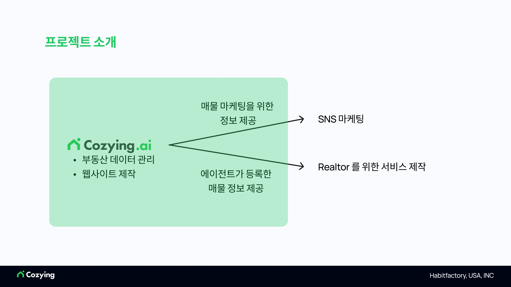
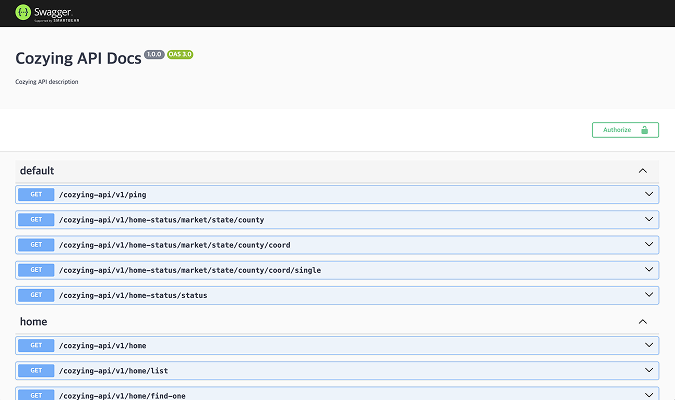
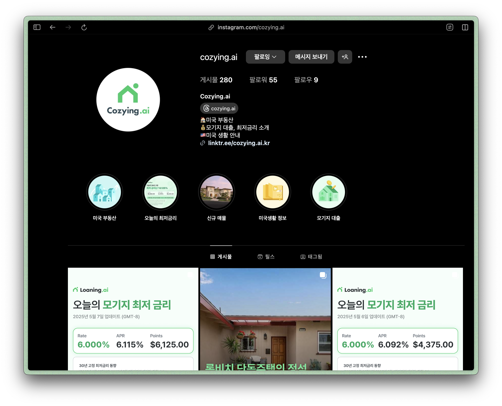
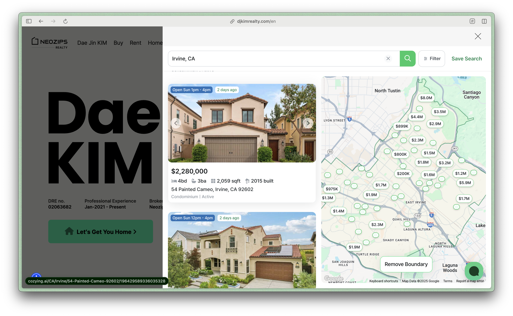
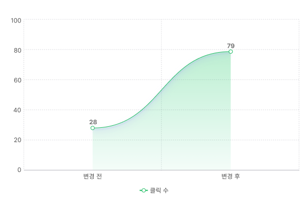

# 미국 부동산 탐색 플랫폼, [Cozying.ai](https://cozying.ai)

**산학연계 자유주제**

> 본 프로젝트의 소스코드는 참여 기업의 요청으로, 담당 교수님과의 논의 후 비공개하기로 결정하였습니다.

  

## 목차

1.  [프로젝트 소개](#프로젝트-소개)
2.  [소개 영상](#소개-영상)
3.  [팀 소개](#팀-소개)
4.  [주요 기능](#주요-기능)
5.  [시스템 구조](#시스템-구조)
6.  [기술 스택](#기술-스택)
7.  [협업 방식](#협업-방식)
8.  [활용 방안 및 기대 효과](#활용-방안-및-기대-효과)
9.  [관련 자료](#관련-자료)

## 프로젝트 소개

본 프로젝트는 미국 내 모기지 렌더(Mortgage Lender)로 활동 중인 Habitfactory USA, INC(이하 해빗팩토리)와의 산학 협력을 통해 진행되는 자유주제 캡스톤 프로젝트이다.
해빗팩토리는 캘리포니아, 조지아, 텍사스 3개 주에서 정식 모기지 라이선스를 보유하고 있으며, 디지털 모기지 대출 플랫폼 Loaning.ai를 운영하고 있다.

이번 프로젝트의 핵심 목표는, 미국 부동산 정보 탐색과 대출 연계를 동시에 지원하는 통합 웹 플랫폼, Cozying.ai를 기획 및 개발하는 것이다.
Cozying.ai는 미국 부동산 매물 데이터베이스인 **MLS(Multiple Listing Service)**로부터 수집한 실시간 데이터를 바탕으로, 사용자에게 직관적인 탐색 환경을 제공한다. 특히, 사용자가 매물을 열람한 이후 Loaning.ai로의 자연스러운 전환을 유도하는 구조를 갖추고 있어, 실질적인 고객 유입 채널로 기능한다.

또한 Cozying.ai는 외부 고객뿐 아니라 사내 활용까지 고려하여 설계된다. 마케팅팀은 해당 플랫폼을 기반으로 SNS 콘텐츠를 제작하고, Realtor와의 파트너십 부서는 Realtor ID 기반 API를 통해 협업 구조를 확립할 수 있다.

결과적으로 Cozying.ai는 단순한 부동산 정보 웹사이트를 넘어, 해빗팩토리의 핵심 비즈니스 채널들과 유기적으로 연동되는 내부 통합 시스템이자, 디지털 대출 고객 유치를 위한 전략적 기반 플랫폼으로 기능할 것이다.

### 기업 요구 사항

✅ 최신 부동산 매물 정보를 정확하게 제공하는 서비스 구현

✅ 영어로 등록된 부동산 매물 정보를 한국어로도 조회할 수 있는 기능 제공

✅ 대용량 부동산 데이터를 효율적으로 관리하고, 팀 내 여러 부서에서 데이터를 활용할 수 있는 시스템 구축

## 소개 영상

## 팀 소개

|  |
| :--------------------------------------------------: |
|  [하철환(\*\*\*\*3157)](https://github.com/hwna00)   |
|                      Full Stack                      |

<!-- TODO: 주요 기능에 대한 설명을 글도 더 추가하기 (간단해보이지 않도록) -->

## 주요 기능

### 매물 검색

  
  

- 사용자가 주소를 입력할 때 Google Place Autocomplete API를 활용하여 쉽고 빠르게 주소를 검색할 수 있도록 지원한다. 또한, 다양한 사용자 입력 예외 상황도 효과적으로 처리한다.

### 예상 비용 계산

  

- 매물 정보를 기반으로 월별 예상 비용을 산출한다.
- Loaning.ai의 데이터를 활용하여 최적화된 금리를 추천한다.
- 모기지 대출이 필요한 고객을 Loaning.ai로 자연스럽게 연계한다.

### 한국어 번역 및 단위 전환

  

- 우측 상단의 언어 변환 버튼을 통해 손쉽게 언어를 변경할 수 있다.
- sqft, sqm, 평 단위 간 전환 기능을 제공하여 다양한 단위로 매물 정보를 조회할 수 있다.
- LLM과 부동산 특화 프롬프트를 활용하여 자연스러운 한국어 번역을 지원한다.

## 시스템 구조

**전체 시스템 아키텍처**

  

**백엔드 아키텍처**

  

**프론트엔드 URL**

> 검색 노출 및 SEO를 위한 URL 구조 생성

| 검색 유형    | URL 구조                            |
| ------------ | ----------------------------------- |
| county       | `/{county}-county`                  |
| city         | `/{city}-{state}`                   |
| zip code     | `/{city}-{state}-{zip}`             |
| neighborhood | `/{neighborhood}_{city}-{state}`    |
| street       | `/{state}/{city}/{street}/{homeId}` |

위의 URL 구조를 바탕으로 Open Graph 태그를 생성한다.

  
  

## 기술 스택

|            | 기술 스택                                                                                                                                                                                                                                                                                                                                                                                                                                                                                                                                                                                                                                                                                                                                                                                                                                                                                                                                                                               |
| :--------: | :-------------------------------------------------------------------------------------------------------------------------------------------------------------------------------------------------------------------------------------------------------------------------------------------------------------------------------------------------------------------------------------------------------------------------------------------------------------------------------------------------------------------------------------------------------------------------------------------------------------------------------------------------------------------------------------------------------------------------------------------------------------------------------------------------------------------------------------------------------------------------------------------------------------------------------------------------------------------------------------- |
| 프론트엔드 |          |
|   백엔드   |                                                                                                                                                                                                                                                                                                                                                                                                                                                |

<!-- TODO: 협업 방식이라고 하지 말고, 타 부서와 협업한 내용도 추가하기 -->

## 협업 방식

### 코드 관리

**AWS CodePipeline**

  

 

AWS CodeCommit을 통해 레포지토리를 관리하고, CodeBuild와 CodeDeploy를 통해 자동화된 배포환경을 구축하였다.

브랜치는 Github Flow 전략을 사용하여 관리하였다. main 브랜치는 운영 가능한 상태로 유지하고, 실제 작업 및 테스트는 develop 브랜치와 feature 브랜치에서 이루어졌다. 새로운 기능의 개발은 develop에서 분기한 feature 브랜치에서 이루어졌다. feature 브랜치의 내용은 develop에 병합되어 개발 환경에서 테스트를 거친 이후 main으로 병합되어 안전한 운영 환경을 유지하였다.

### 문서 관리

**Notion**

  

 

- Notion 을 통해 프로젝트 과정을 문서화
- 담당자와 우선순위를 지정하여 일정 관리

**Swagger**

  

 

- Swagger를 통해 API 문서를 관리
- 프론트엔드와 백엔드 간 협업 환경에서 사용
- Realtor와의 협업을 위한 API 문서화

### 의사 소통

  
  

 

- 현지 Realtor 파트너로부터 직접 피드백을 주고 받음
- 피드백 기반으로 신규 기능 제작
- 개발 피드백 및 코드 리뷰 진행

## 활용 방안

**Cozying.ai의 정보를 바탕으로 SNS 마케팅 진행**

  
  

**Cozying.ai의 정보를 바탕으로 현지 Realtor들과의 파트너십 구축**

  
  

## 기대 효과

  
  

 

- 프로젝트 시작 전 6개월간 노출 수는 549회, 클릭 수는 28회였던 반면, 프로젝트 이후에는 각각 18,100회와 79회로 크게 증가했다.
- 이를 통해 Cozying에서 Loaning으로의 사용자 유입 확대에 실질적인 도움이 될 수 있음을 기대한다.

## 관련 자료

- [중간 발표 자료](https://drive.google.com/file/d/1UNU74_llJY3mxuVGz1hk-Zh_f6rMqUz8/view?usp=sharing)
- [포스터](https://drive.google.com/file/d/1WFEYLmeG0RcIWCfBUfccKdkBSn990Q6g/view?usp=sharing)
- [최종 발표자료](https://drive.google.com/file/d/1qDduAgvGArl4cnC9ol3Hmlaw3-JcqQ1W/view?usp=sharing)
- [결과보고서](https://docs.google.com/document/d/18CM3sdQE5zqWrj1B63b7y-3w0rI4Mpa6/edit?usp=sharing&ouid=116310879167524674498&rtpof=true&sd=true)
