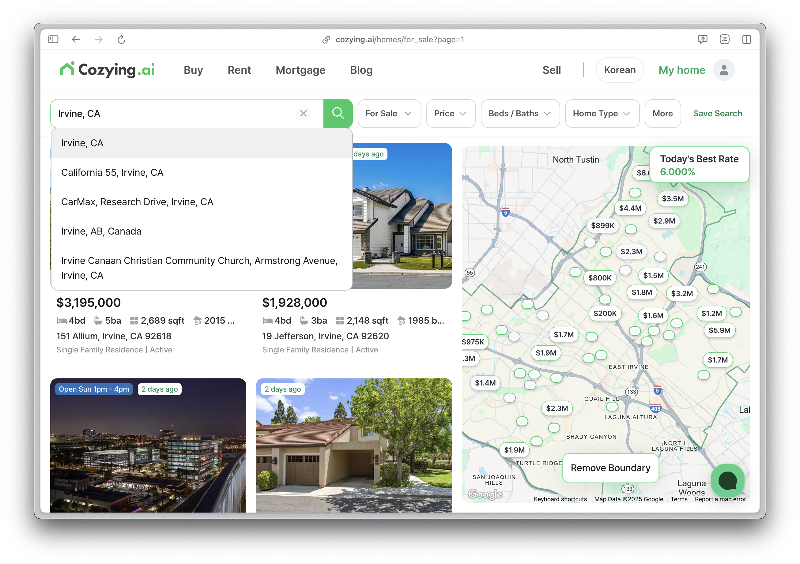
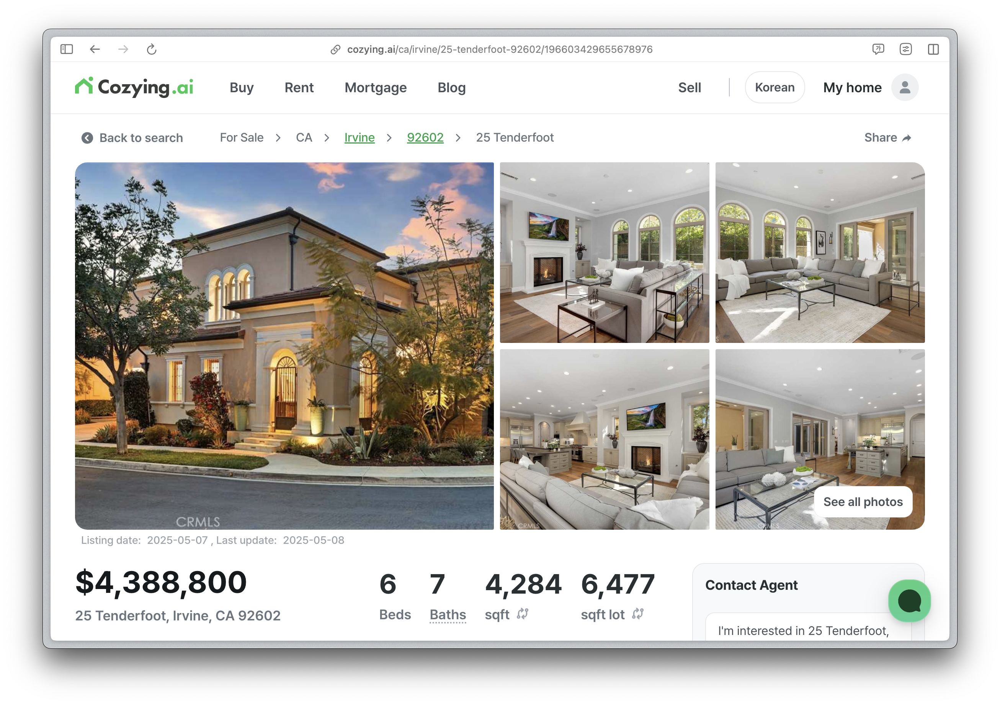

# 미국 부동산 탐색 플랫폼, [Cozying.ai](https://cozying.ai)

  

## 목차

1. [프로젝트 소개](#1-프로젝트-소개)
2. [소개 영상](#2-소개-영상)
3. [팀 소개](#3-팀-소개)
4. [주요 기능](#4-주요-기능)
5. [시스템 구조](#5-시스템-구조)
6. [기술 스택](#6-기술-스택)
7. [활용 방안 및 기대 효과](#7-활용-방안-및-기대-효과)

## 1. 프로젝트 소개

본 프로젝트는 미국 내 모기지 렌더(Mortgage Lender)로 활동 중인 **Habitfactory USA, INC**(이하 해빗팩토리)와의 산학 협력을 통해 진행한다.
미국 부동산 정보를 효율적으로 탐색하고, 실질적인 대출 연계까지 가능한 **온라인 부동산 플랫폼 Cozying.ai**의 기획 및 개발을 주요 목표로 삼는다.

해빗팩토리는 현재 캘리포니아주와 조지아주, 텍사스주에 라이선스를 보유하고 있으며, 그 중 캘리포니아주와 조지아주 지역의 MLS(Multiple Listing Service) 데이터를 기반으로 실거주용 및 투자용 매물 정보를 수집·제공한다.
Cozying.ai는 이 데이터를 활용하여 사용자가 **직관적인 UI/UX를 통해 부동산 매물을 탐색하고**, 필요 시 자사의 온라인 모기지 대출 플랫폼인 **Loaning.ai**와 연계하여 모기지 대출까지 진행할 수 있도록 설계된 통합 플랫폼이다.

또한, 이렇게 제작된 플랫폼은 사용자가 직접 방문하여 매물을 탐색할 수 있을 뿐만 아니라, 각 지역의 Realtor와 협업하거나 소셜 미디어 마케팅의 참고 자료로도 활용할 계획이다.

### 기업 요구 사항

✅ 최신 부동산 매물 정보를 정확하게 제공하는 서비스 구현

✅ 영어로 등록된 부동산 매물 정보를 한국어로도 조회할 수 있는 기능 제공

✅ 대용량 부동산 데이터를 효율적으로 관리하고, 팀 내 여러 부서에서 데이터를 활용할 수 있는 시스템 구축

## 2. 소개 영상

(프로젝트 소개하는 영상을 추가하세요)

## 3. 팀 소개

|  |
| :--------------------------------------------------: |
|  [하철환(\*\*\*\*3157)](https://github.com/hwna00)   |
|                      Full Stack                      |

## 4. 주요 기능

### 매물 검색

  
  

- 사용자가 주소를 입력할 때 Google Place Autocomplete API를 활용하여 쉽고 빠르게 주소를 검색할 수 있도록 지원한다. 또한, 다양한 사용자 입력 예외 상황도 효과적으로 처리한다.

### 예상 비용 계산

  

- 매물 정보를 기반으로 월별 예상 비용을 산출한다.
- Loaning.ai의 데이터를 활용하여 최적화된 금리를 추천한다.
- 모기지 대출이 필요한 고객을 Loaning.ai로 자연스럽게 연계한다.

### 한국어 번역 및 단위 전환

  

- 우측 상단의 언어 변환 버튼을 통해 손쉽게 언어를 변경할 수 있다.
- sqft, sqm, 평 단위 간 전환 기능을 제공하여 다양한 단위로 매물 정보를 조회할 수 있다.
- LLM과 부동산 특화 프롬프트를 활용하여 자연스러운 한국어 번역을 지원한다.

## 5. 시스템 구조

  

  

## 6. 기술 스택

|            | 기술 스택                                                                                                                                                                                                                                                                                                                                                                                                                                                                                                                                                                                                                                                                                                                                                                                                                                                                                                                                                                               |
| :--------: | :-------------------------------------------------------------------------------------------------------------------------------------------------------------------------------------------------------------------------------------------------------------------------------------------------------------------------------------------------------------------------------------------------------------------------------------------------------------------------------------------------------------------------------------------------------------------------------------------------------------------------------------------------------------------------------------------------------------------------------------------------------------------------------------------------------------------------------------------------------------------------------------------------------------------------------------------------------------------------------------- |
| 프론트엔드 |          |
|   백엔드   |                                                                                                                                                                                                                                                                                                                                                                                                                                                |

## 7. 활용 방안 및 기대 효과

### 활용 방안

**Cozying.ai의 정보를 바탕으로 SNS 마케팅 진행**

  
  

**Cozying.ai의 정보를 바탕으로 현지 Realtor들과의 파트너십 구축**

  

### 기대 효과

- Cozying.ai를 통해 Loaning.ai 서비스로 전환되는 고객 수 증가

## 8. 관련 자료

(추가 예정)

- 중간 발표 자료
- 포스트
- 최종 발표자료
- 결과보고서
