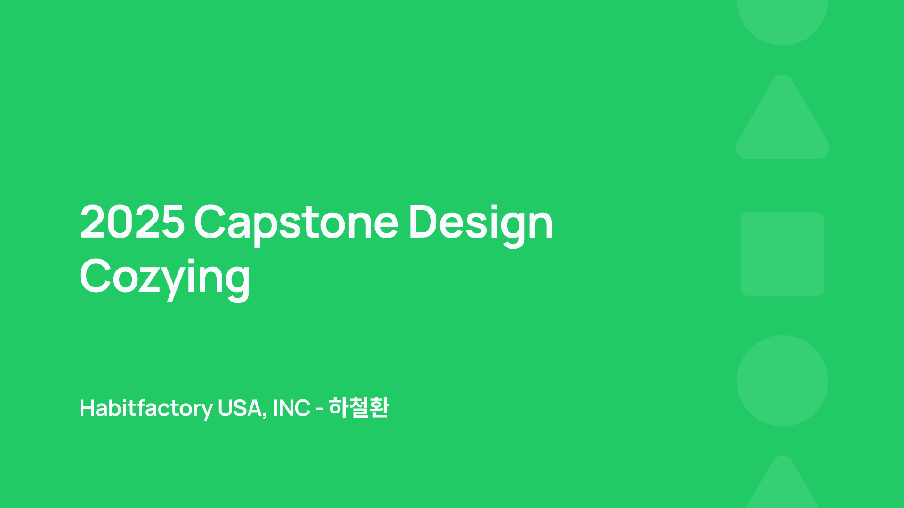

# 미국 부동산 탐색 플랫폼, [Cozying.ai](https://cozying.ai)

**산학연계 자유주제**

> 본 프로젝트의 소스코드는 참여 기업의 요청으로, 담당 교수님과의 논의 후 비공개하기로 결정하였습니다.

  

## 목차

1.  [프로젝트 소개](#프로젝트-소개)
2.  [소개 영상](#소개-영상)
3.  [팀 소개](#팀-소개)
4.  [사용방법](#사용-방법)
5.  [서비스 구현](#서비스-구현)
6.  [기술 스택](#기술-스택)
7.  [협업 방식](#협업-방식)
8.  [활용 방안 및 기대 효과](#활용-방안-및-기대-효과)
9.  [관련 자료](#관련-자료)

## 프로젝트 소개

본 프로젝트는 미국 내 모기지 렌더(Mortgage Lender)로 활동 중인 Habitfactory USA, INC(이하 해빗팩토리)와의 산학 협력을 통해 진행되는 자유주제 캡스톤 프로젝트이다.
해빗팩토리는 캘리포니아, 조지아, 텍사스 3개 주에서 정식 모기지 라이선스를 보유하고 있으며, 디지털 모기지 대출 플랫폼 Loaning.ai를 운영하고 있다.

이번 프로젝트의 핵심 목표는, 미국 부동산 정보 탐색과 대출 연계를 동시에 지원하는 통합 웹 플랫폼, Cozying.ai를 기획 및 개발하는 것이다.
Cozying.ai는 미국 부동산 매물 데이터베이스인 **MLS(Multiple Listing Service)**로부터 수집한 실시간 데이터를 바탕으로, 사용자에게 직관적인 탐색 환경을 제공한다. 특히, 사용자가 매물을 열람한 이후 Loaning.ai로의 자연스러운 전환을 유도하는 구조를 갖추고 있어, 실질적인 고객 유입 채널로 기능한다.

또한 Cozying.ai는 외부 고객뿐 아니라 사내 활용까지 고려하여 설계된다. 마케팅팀은 해당 플랫폼을 기반으로 SNS 콘텐츠를 제작하고, Realtor와의 파트너십 부서는 Realtor ID 기반 API를 통해 협업 구조를 확립할 수 있다.

결과적으로 Cozying.ai는 단순한 부동산 정보 웹사이트를 넘어, 해빗팩토리의 핵심 비즈니스 채널들과 유기적으로 연동되는 내부 통합 시스템이자, 디지털 대출 고객 유치를 위한 전략적 기반 플랫폼으로 기능할 것이다.

### 기업 요구 사항

✅ 최신 부동산 매물 정보를 정확하게 제공하는 서비스 구현

✅ 영어로 등록된 부동산 매물 정보를 한국어로도 조회할 수 있는 기능 제공

✅ 대용량 부동산 데이터를 효율적으로 관리하고, 팀 내 여러 부서에서 데이터를 활용할 수 있는 시스템 구축

## 소개 영상

## 팀 소개

|  |
| :--------------------------------------------------: |
|  [하철환(\*\*\*\*3157)](https://github.com/hwna00)   |
|            Full Stack Service Development            |

## 사용 방법

### 메인 화면

  

1번: 헤더

- `Buy` 및 `Rent` 매물 목록 보기로 가는 바로가기 버튼을 제공한다.
- `Mortgage` 버튼을 클릭하면 Loaning의 모기지 확인 서비스로 이동한다.
- `Blog` 버튼을 클릭하면 회사에서 운영하는 마케팅 채널로 이동한다.
  - 언어 설정을 영어로 하고 접속 시, 워드프레스 영어 블로그로 이동한다.
  - 언어 설정을 한국어로 하고 접속 시, 네이버 블로그로 이동한다.
- `Sell` 버튼을 클릭하면 ‘부동산 판매하기’ 페이지로 이동한다.
- `Korean` 버튼을 누르면 사이트가 한국어로 번역된다.
  - 한국어로 설정되어 있을 때는 `English` 버튼이 보이게 된다.
- `My home` 버튼을 클릭하면 마이 페이지로 이동하게 된다.
  - 만약 로그인이 되어있지 않다면 로그인 모달이 뜨게 된다.

2번: 지역 검색하기

- 원하는 지역을 검색할 수 있는 입력창이다.

3번: 문의하기

- Channel Talk 을 이용한 문의하기 버튼이다.

### 검색 기반 매물 추천

  

최근 검색한 지역이 있는 경우, 해당 지역의 매물을 최상단에 보여준다.
만약 최근 검색한 지역이 없거나, 해당 지역의 매물 수가 적은 경우에는 나타나지 않는다.

### 검색 결과 화면

  

1번: 검색 옵션

- 좌측의 검색창을 통해 매물을 탐색하고자 하는 주소를 검색할 수 있다.
- 매물 타입, 가격, 그리고 집의 특징으로 필터링 옵션을 선택할 수 있다.
- 가장 우측에 `Save Searches` 버튼을 클릭하면 현재 검색 옵션을 저장할 수 있다. 저장한 옵션은 마이페이지에서 확인 가능하다.

2번: 검색 결과

- 검색어 및 필터를 설정하고 검색한 결과를 카드 형태의 컴포넌트로 확인할 수 있다.

3번: 지도

- 검색 결과를 우측의 지도를 통해서 확인할 수 있다.
- 지도의 하단 가운데 `Remove Boundary` 버튼을 통해 현재 적용된 검색 결과를 해제할 수 있다.

4번: Loaning 전환 배너

- 검색 결과 사이에 사용자를 Loaning으로 유도할 수 있는 배너이다. 배너에는 오늘의 이자율, 이자율 비교 등의 정보가 담겨있다.

### 단위 변환

  

1번: 변환 버튼

- 단위를 전환할 수 있는 버튼이다.
- 언어가 영어인 경우 sqft, sqm 중에서 선택 가능하다.
- 언어가 한국어인 경우에는 sqft, sqm, 평 중에서 선택 가능하다.

2번: 변화 결과

- 단위가 변환되면 그에 따른 영향을 받는 부분이다.

### 예상 비용 계산

  

- 우측의 `Payment Calculator` 기능을 활용하여, 현재 보고 있는 매물을 구매했을 때 예상되는 월별 지불 비용을 계산할 수 있다.
- 계산기 안의 툴팁을 통해, 각 용어에 대한 설명을 확인할 수 있다.
- `Get Pre-approval` 버튼을 클릭하면 Loaning 사이트로 전환되어, 모기지 대출에 필요한 정보를 확인할 수 있다.

## 서비스 구현

**전체 시스템 아키텍처**

  

**백엔드 아키텍처**

  

- Cron Job 을 통해 주기적으로 MLS로부터 신규 매물 Fetch
- DB Transaction을 통해 안정적으로 업데이트 로직을 실행
- Service Layer를 분리하여 각 지역(State/County)별 데이터 처리 로직을 유연하게 관리
- Adapter Pattern을 활용해 CRMLS, FMLS 등 다양한 MLS 포맷을 일관된 내부 구조로 통합

**한국어 번역**

  

- Nuxt I18N 모듈을 활용하여 정적인 번역 제공
- LLM과 프롬프트를 사용하여 매물 정보에 대한 한국어 번역 제공

아래 표는 동일한 부동산 매물 문장을 다양한 번역 도구(Google 번역기, DeepL, gpt-4o-mini)를 통해 번역한 결과를 비교한 것으로, `turnkey`와 같은 부동산 전문 용어의 맥락 전달력 차이를 보여준다.

여기서 turnkey는 “즉시 입주 가능한 완성형 주택”을 의미하며, 별도의 수리나 공사 없이 바로 거주가 가능한 상태를 뜻하는 미국 부동산 용어이다.

| 구분                       | 번역 결과                                                                                                                                                                                                    |
| -------------------------- | ------------------------------------------------------------------------------------------------------------------------------------------------------------------------------------------------------------ |
| **원문**                   | … With upgraded flooring and countertops, this **turnkey home** is move-in ready. Plus, enjoy biking to the new Great Park and Wild Rivers Water Park this summer!                                           |
| **Google 번역기**          | … 고급 바닥재와 조리대가 설치된 이 **턴키(Turnkey) 주택**은 즉시 입주 가능합니다. 이번 여름에는 새롭게 조성된 그레이트 파크와 와일드 리버스 워터파크까지 자전거를 타고 즐거운 시간을 보내세요!               |
| **DeepL**                  | … 업그레이드된 바닥재와 조리대를 갖춘 이 **턴키 주택**은 바로 입주할 수 있습니다. 또한 올여름에는 새로운 그레이트 파크와 와일드 리버 워터파크에서 자전거를 즐겨보세요!                                       |
| **gpt-4o-mini (LLM 기반)** | 바닥재와 조리대가 업그레이드된 이 집은 **즉시 입주 가능한 완성형 주택**입니다. 또한, 올여름에는 자전거를 타고 새롭게 조성된 Great Park와 Wild Rivers Water Park까지 이동하며 야외 활동을 만끽할 수 있습니다. |

**이미지 Lazy Loading**

  

- Cozying.ai는 미국 서부 서버에서 운영되며, MLS 매물 이미지 로딩이 많은 네트워크 리소스를 요구함
- 이를 해결하기 위해 Intersection Observer API 기반의 커스텀 LazyImg 컴포넌트를 제작하여 안정적으로 lazy loading 구현
- 별도 라이브러리 없이 브라우저 네이티브 기능만으로 제작해 유지보수성과 재사용성 확보, 전체 이미지에 일괄 적용 가능
- 개발자 도구의 네트워크 탭을 통해 실제 이미지가 viewport 진입 시 로드되는 것을 확인할 수 있음

**프론트엔드 URL**

> 검색 노출 및 SEO를 위한 URL 구조 생성

| 검색 유형    | URL 구조                            |
| ------------ | ----------------------------------- |
| county       | `/{county}-county`                  |
| city         | `/{city}-{state}`                   |
| zip code     | `/{city}-{state}-{zip}`             |
| neighborhood | `/{neighborhood}_{city}-{state}`    |
| street       | `/{state}/{city}/{street}/{homeId}` |

위의 URL 구조를 바탕으로 Open Graph 태그를 생성하여 SEO 최적화를 시도했다.

  
  

## 기술 스택

|            | 기술 스택                                                                                                                                                                                                                                                                                                                                                                                                                                                                                                                                                                                                                                                                                                                                                                                                                                                                                                                                                                               |
| :--------: | :-------------------------------------------------------------------------------------------------------------------------------------------------------------------------------------------------------------------------------------------------------------------------------------------------------------------------------------------------------------------------------------------------------------------------------------------------------------------------------------------------------------------------------------------------------------------------------------------------------------------------------------------------------------------------------------------------------------------------------------------------------------------------------------------------------------------------------------------------------------------------------------------------------------------------------------------------------------------------------------- |
| 프론트엔드 |          |
|   백엔드   |                                                                                                                                                                                                                                                                                                                                                                                                                                                |

## 협업 방식

### 코드 관리

**AWS CodePipeline**

  

 

- AWS Codecommit을 통해 소스코드 관리
- CodeBuild와 CodeDeploy를 통해 자동화된 배포환경을 구축
- Github Flow 전략을 사용하여 브랜치를 관리
  - main: 운영 가능한 상태로 유지
  - develop: 기능 통합 테스트
  - feature: 새로운 기능 개발

### 문서 관리

**Notion**

  

 

- Notion 을 통해 프로젝트 과정을 문서화
- 담당자와 우선순위를 지정하여 일정 관리

**Swagger**

  

 

- Swagger를 통해 API 문서를 관리
- 프론트엔드와 백엔드 간 협업 환경에서 사용
- Realtor와의 협업을 위한 API 문서화

### 의사 소통

  
  

 

- 현지 Realtor 파트너로부터 직접 피드백을 주고 받음
- 피드백 기반으로 신규 기능 제작
- 개발 피드백 및 코드 리뷰 진행

## 활용 방안

**Cozying.ai의 정보를 바탕으로 SNS 마케팅 진행**

  
  

**Cozying.ai의 정보를 바탕으로 현지 Realtor들과의 파트너십 구축**

  
  

## 기대 효과

  
  

 

- 프로젝트 시작 전 6개월간 노출 수는 549회, 클릭 수는 28회였던 반면, 프로젝트 이후에는 각각 18,100회와 79회로 크게 증가했다.
- 이를 통해 Cozying에서 Loaning으로의 사용자 유입 확대에 실질적인 도움이 될 수 있음을 기대한다.

## 관련 자료

- [중간 발표 자료](https://drive.google.com/file/d/1UNU74_llJY3mxuVGz1hk-Zh_f6rMqUz8/view?usp=sharing)
- [포스터](https://drive.google.com/file/d/1WFEYLmeG0RcIWCfBUfccKdkBSn990Q6g/view?usp=sharing)
- [최종 발표자료](https://docs.google.com/presentation/d/1bPRViR5_9dUePePBSnXcmkBEgDY8DCrgLJMDRfB02yQ/edit?usp=sharing)
- [결과보고서](https://docs.google.com/document/d/18CM3sdQE5zqWrj1B63b7y-3w0rI4Mpa6/edit?usp=sharing&ouid=116310879167524674498&rtpof=true&sd=true)
